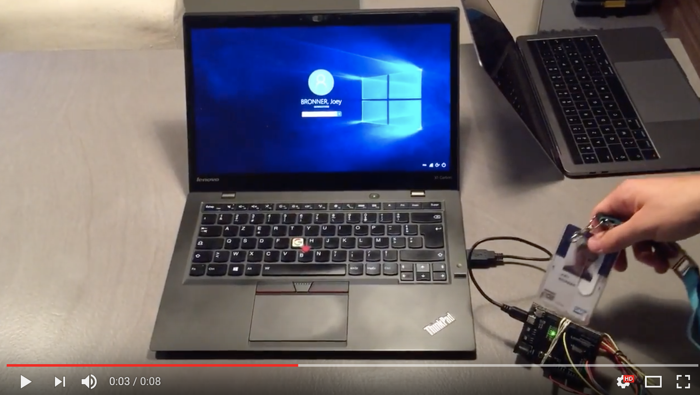

# Arduino RFID Session Password Typer

*Unlock your session using your pass card (RFID)*

### Demo

#### Electronics

 - 1x Arduino Leonardo
 - 1x NFC RFID-RC522

#### 3D Printing

<a href="http://www.thingiverse.com/thing:940524" target="_blank">RFID case @thingiverse</a>

#### Useful links

<a href="https://www.arduino.cc/en/Reference/KeyboardModifiers" target="_blank">Keyboard Modifiers</a>
<a href="https://www.arduino.cc/en/Tutorial/KeyboardReprogram" target="_blank">Keyboard Reprogram</a>
<a href="https://cdn.arduino.cc/reference/en/language/functions/usb-leonardo-and-due-only/keyboard/keyboardPrint/" target="_blank">Keyboard Print</a>
<a href="https://www.arduino.cc/en/Tutorial/KeyboardMessage" target="_blank">Keyboard Message</a>
<a href="https://www.arduino.cc/en/Reference/KeyboardPrintln" target="_blank">Keyboard Println</a>
